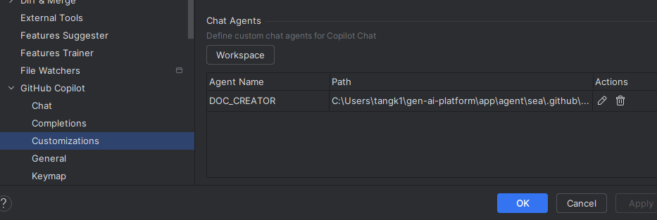

# Agent mode

1. 什么是 AI Agent（在编程领域）？
如果说 Vibe Coding 是一种工作流或心态，那么 Agent（智能体） 就是实现这种工作流背后的超级执行者。
核心定义：
普通的 LLM（如 ChatGPT 网页版）是“你问我答”。而 Agent 是具备自主性、工具使用能力和规划能力的系统。在编程场景下，Agent 就像是一个不知疲倦的初级工程师。
Agent 与普通 AI 的区别：
环境感知： Agent 能读取你的整个项目文件夹，知道文件结构，而不是只知道你粘贴的那一段代码。
工具使用： Agent 可以执行终端命令（Terminal）、运行代码、读取报错信息、搜索文档。
循环执行（Loop）：
普通 AI： 写代码 -> 给你。
Agent： 写代码 -> 运行 -> 报错 -> 自己读报错 -> 修改代码 -> 再运行 -> 成功 -> 给你。

2. 提示词工程（Prompt Engineering）依然重要
虽然不需要写代码，但你需要清晰地描述逻辑。

## 如何自定义一个agent
https://docs.github.com/en/copilot/concepts/agents/coding-agent/about-custom-agents

You can define agent profiles at the repository level (.github/agents/CUSTOM-AGENT-NAME.md in your repository) for project-specific agents, or at the organization or enterprise level (/agents/CUSTOM-AGENT-NAME.md in a .github-private repository) for broader availability. See Preparing to use custom agents in your organization and Preparing to use custom agents in your enterprise.

https://code.visualstudio.com/blogs/2025/04/07/agentMode

## Handoffs（代理接力）

功能：支持从一个代理无缝切换至下一个代理，保留上下文并可预填提示词。

用途示例：

规划 → 实施

实施 → 代码审查

写失败测试 → 写通过测试

定义方式：在 frontmatter 中添加 handoffs 字段，设置目标代理、按钮标签、提示内容及是否自动发送。

## 微软官方关于这个的workshop

- [GitHub Copilot: Agent Mode](https://code.visualstudio.com/blogs/2025/04/07/agentMode)

https://github.com/microsoft/github-copilot-vibe-coding-workshop

